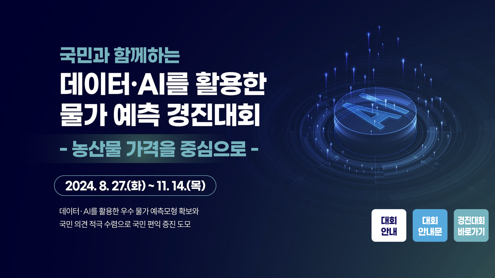

# 데이터 & AI를 활용한 물가 예측 경진대회

## 주관
- 디지털플랫폼정부위원회
- 농림축산식품부

## 주최
- 한국농수산식품유통공사
- 한국지능정보사회진흥원

## 후원
- 한국인공지능학회

## 기간
- 2024.10.01-2024.11.14

## 참여 및 수상
- **참여 유형**: 개인(1인)
- **결과**: 우수상 (한국인공지능학회장상)
- **상금**: 500만 원

---

## 대회 개요
### 1차 예선
- **목표**: 국민생활과 밀접한 10개 농산물 품목의 가격 예측  
  *(배추, 무, 양파, 사과, 배, 건고추, 깐마늘, 감자, 대파, 상추)*

- **접근 방법**:
  1. **가격 데이터의 스케일링 없이 트리 모델 기반 예측**:
      - 데이터 전처리 과정에서 스케일링을 생략하여 **트리 모델의 장점을 극대화**.
  2. **두 가지 모델 설계**:
      - **Single-output 모델**:
        - 단일 시점에서 각 품목의 가격을 독립적으로 예측.
        - 단순하지만 품목별 세부 예측에 강점.
      - **Multi-output 모델**:
        - 여러 품목의 가격을 동시에 예측하는 모델 구축.
        - 품목 간 상관관계를 반영하여 **전체적인 예측 안정성** 향상.
  3. **시계열 데이터 활용**:
      - 가격 시계열 데이터를 기반으로 **트리 모델**을 학습하여 시간에 따른 가격 변화를 예측.
      - **Single-output 모델과 Multi-output 모델을 적절히 결합**하여 시계열 데이터를 안정적으로 예측.
      - 단일 품목의 세부적인 변동과 품목 간 상관성을 동시에 고려.

- **결과**:
  - **2차 예선 진출**:
    - 단순하고 효율적인 예측 모델 설계가 높은 평가를 받아 본선 진출 확정.

---

### 2차 예선
- **목표**: 동일한 10개 농산물 품목의 가격 예측 *(배추, 무, 양파, 사과, 배, 건고추, 깐마늘, 감자, 대파, 상추)*

- **접근 방법**:
  - 가격 데이터에 대한 **스케일링을 진행하지 않고 트리 모델** 사용.
  - 1차 예선과 동일하게:
    - **가격 시계열 데이터** 기반 트리 모델.
    - 관련 요인(기상, 도매시장 수급, 소매가, 중도매가, 수출입 등)을 활용한 가격 **기울기** 예측 모델.

- **주요 분석 및 개선**:
  1. **농산물 가격의 높은 변동성 분석**:
      - 농산물의 가격은 특정 기간 동안 **큰 변동폭**을 나타내는 경우가 많아 단순 평균값 기반 예측의 한계를 확인.
      - 이를 해결하기 위해 변동성을 반영한 예측값 설계.

  2. **예측값의 다차원화**:
      - 모델의 예측값을 단일 결과가 아닌, **상한, 평균, 하한**의 세 가지 예측값으로 구성:
        - **상한**: 가격 상승 리스크를 고려한 예측.
        - **평균**: 일반적인 가격 경향성 반영.
        - **하한**: 가격 하락 리스크를 반영.

  3. **예측값을 활용한 Feature Engineering**:
      - 상한, 평균, 하한 예측값을 하나의 feature로 결합하여 **다음 시점 예측의 입력 변수로 활용**.
      - 각 예측값의 **모멘텀**(변화율)을 계산해 **시간적 트렌드**를 반영.

  4. **모멘텀 기반의 가중평균 모델 설계**:
      - 상한, 평균, 하한 값에 **가중치를 부여**하여 최종 예측값 도출:
        - **가중치 할당**: 최근의 예측값 모멘텀에 따라 각 값에 동적으로 가중치 적용.
        - **가중평균 계산**: 과거와 현재 예측값의 가중평균을 통해 시계열 데이터를 **안정적으로 보정**.
      - 이 방식으로 극단적인 변동성을 완화하고 **실제 가격 추세에 근접한 결과** 생성.

  5. **결과의 해석 가능성 강화**:
      - 최종 예측값이 상한/평균/하한의 조합으로 도출되기 때문에:
        - 예측 결과에 대한 해석이 용이.
        - 사용자가 다양한 시나리오를 고려한 의사결정 가능.

- **결과**:
  - 변동성을 반영한 다차원 예측 접근법과 모멘텀 기반 가중평균 설계로 예측 성능 개선.
  - **본선 진출** 성공.

---

### 본선
- **목표**:
  - 2차 예선에서 구축한 모델의 논리 및 결과를 보고서로 작성.
  - 2024 정부박람회에서 모델 논리를 발표.

---

## 주요 성과
- 우수상 수상 (한국인공지능학회장상)
- 상금 500만 원
- 모델의 실효성과 독창성을 인정받아 정부박람회에서 발표 기회 획득.